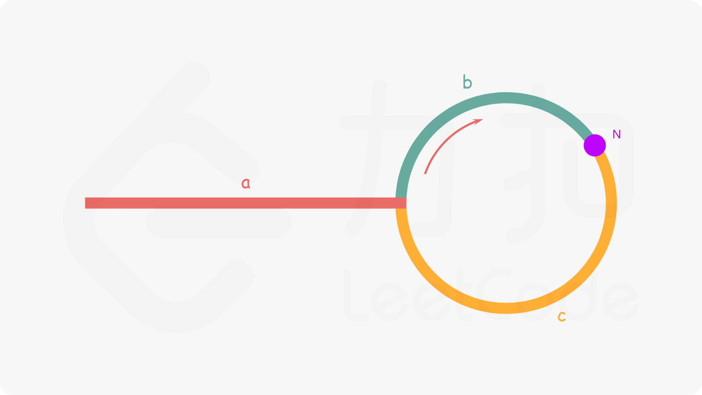

#### 两数之和
*LeetCode1 Easy*
*Tags: array | hash-table*

给定一个整数数组`nums`和一个整数目标值`target`，请你在该数组中找出**和为目标值**`target`的那**两个**整数，并返回它们的数组下标。
你可以假设每种输入只会对应一个答案。但是，数组中同一个元素在答案里不能重复出现。
你可以按任意顺序返回答案。

```
示例1：
输入：nums = [2,7,11,15], target = 9
输出：[0,1]
解释：因为 nums[0] + nums[1] == 9 ，返回 [0, 1]

示例2：
输入：nums = [3,2,4], target = 6
输出：[1,2]

示例3：
输入：nums = [3,3], target = 6
输出：[0,1]
```


答案1：暴力枚举
**思路**
枚举数组中的每一个数`x`，寻找数组中是否存在`target-x`；双层循环，第一层循环取`x`，第二层循环在数组中找`target-x`，第二次循环只需要找x之后的元素就可以了。
```js 
const twoSum = (nums, target) => {
    for(let i = 0; i < nums.length; i++) {
        for (let j = i + 1; j < nums.length; j++) {
            if (nums[i] + nums[j] === target) {
                return [i, j];
            }
        }
    }
};
```
* 时间复杂度：O($N^{2}$)
* 空间复杂度：O(1)

答案2：哈希表
**思路**
创建一个哈希表，对于每一个x，首先查询哈希表中是否存在target-x，存在即得到答案，不存在则继续遍历。
```js 
const twoSum = (nums, target) => {
    let cache = {};
    for(let i = 0; i < nums.length; i++) {
        if ((target - nums[i]) in cache) {
            return [cache[target - nums[i]], i];
        } else {
            cache[nums[i]] = i;
        }
    }
};
```
* 时间复杂度：O(N)
* 空间复杂度：O(N)

#### 斐波那契数
*LeetCode509 Easy*
*Tags: tree*

斐波那契数，通常用`F(n)`表示，形成的序列称为**斐波那契数列**。该数列由`0`和`1`开始，后面的每一项数字都是前面两项数字的和。也就是：
> F(0) = 0，F(1) = 1
> 
> F(n) = F(n - 1) + F(n - 2)，其中 n > 1

给你`n`，请计算`F(n)`。

```
示例1：
输入：2
输出：1
解释：F(2) = F(1) + F(0) = 1 + 0 = 1

示例2：
输入：3
输出：2
解释：F(3) = F(2) + F(1) = 1 + 1 = 2

示例3：
输入：4
输出：3
解释：F(4) = F(3) + F(2) = 2 + 1 = 3
```

答案1：递归
```js
const fib = n => n <= 1 ? n : fib(n - 1) + fib(n - 2);
```

答案2：递推
```js
const fib = (n) => {
    let arr = [];
    for (let i = 0; i <= n; i++) {
        if (i <= 1) {
            arr.push(i);
        } else {
            arr.push(arr[i - 1] + arr[i - 2]);
        }
    }
    return arr.pop();
}
```
* 时间复杂度：O(n)
* 空间复杂度：O(n)

答案3：动态规划
**思路**
斐波那契数的边界条件是`F(0)=0`和`F(1)=1`。当`n>1`时每一项的和都是等于前两项的和，因此有如下递推关系：`F(n)=F(n-1)+F(n-2)`
由于斐波那契数存在递推关系，因此可以使用动态规划求解。动态规划的状态转移方程即为上述递推关系，边界条件`F(0)`和`F(1)`。
根据状态转移方程和边界条件，可以得到时间复杂度和空间复杂度都是`O(n)`的实现。由于`F(n)`只和`F(n-1)`与`F(n-2)`有关，因此可以使用【滚动数组思想】把空间复杂度优化成`O(1)`。

```js
const fib = (n) => {
    if (n <= 1) {
        return n;
    }
    let [p, q, r] = [0, 0, 1];
    for (let i = 2; i <= n; i++) {
        [p, q, r] = [q, r, q + r];
    }
    return r;
}
```
* 时间复杂度：O(n)
* 空间复杂度：O(1)

#### 有效的括号
*LeetCode20 Easy*
*Tags: string | stack*

给定一个只包括`'('`，`')'`，`'{'`，`'}'`，`'['`，`']'` 的字符串`s`，判断字符串是否有效。

有效字符串需满足：
左括号必须用相同类型的右括号闭合。
左括号必须以正确的顺序闭合。

```
示例1：
输入：s = "()"
输出：true

示例2：
输入：s = "()[]{}"
输出：true

示例 3：
输入：s = "(]"
输出：false

示例 4：
输入：s = "([)]"
输出：false

示例 5：
输入：s = "{[]}"
输出：true
```

答案：栈
**思路**
判断括号的有效性可以使用【栈】这一数据结构来解决。
遍历给定的字符串`s`。当遇到一个左括号时，我们会期望在后续的遍历中，有一个相同类型的右括号将其闭合。由于**后遇到的左括号要先闭合**，因此我们可以将这个左括号放入栈顶。
当我们遇到一个右括号时，我们需要将一个相同类型的左括号闭合。此时，我们可以取出栈顶的左括号并判断它们是否是相同类型的括号。如果不是相同的类型，或者栈中并没有左括号，那么字符串`s`无效，返回`false`。为了快速判断括号的类型，我们可以使用哈希表存储每一种括号的对应关系。
在遍历结束后，如果栈不为空，返回`false`，否则返回`true`。
遍历前，可以先判断`s`的长度是否为偶数，如果长度是奇数，则直接返回`false`。

```js
const isValid = (s) => {
    if (s.length % 2) {
        return false;
    }
    let stack = [];
    let map = new Map([['(', ')'], ['[', ']'], ['{', '}']]);
    for (let i = 0; i < s.length; i++) {
        if (map.has(s[i])) {
            stack.push(s[i]);
        } else {
            if (map.get(stack.pop()) === s[i]) {
                continue;
            } else {
                return false;
            }
        }
    }
    return stack.length === 0;
};
```

#### 简化路径
*LeetCode71 Medium*
*Tags: string | stack*

给你一个字符串`path`，表示指向某一文件或目录的`Unix`风格 绝对路径（以`'/'`开头），请你将其转化为更加简洁的规范路径。
在`Unix`风格的文件系统中，一个点（.）表示当前目录本身；此外，两个点（..）表示将目录切换到上一级（指向父目录）；两者都可以是复杂相对路径的组成部分。任意多个连续的斜杠（即，'//'）都被视为单个斜杠'/'。对于此问题，任何其他格式的点（例如，'...'）均被视为文件/目录名称。
请注意，返回的**规范路径**必须遵循下述格式：

* 始终以斜杠'/'开头。
* 两个目录名之间必须只有一个斜杠'/'。
* 最后一个目录名（如果存在）不能 以'/'结尾。
* 此外，路径仅包含从根目录到目标文件或目录的路径上的目录（即，不含'.'或'..'）。

返回简化后得到的**规范路径**。

```js
示例 1：
输入：path = "/home/"
输出："/home"
解释：注意，最后一个目录名后面没有斜杠。 

示例 2：
输入：path = "/../"
输出："/"
解释：从根目录向上一级是不可行的，因为根目录是你可以到达的最高级。

示例 3：
输入：path = "/home//foo/"
输出："/home/foo"
解释：在规范路径中，多个连续斜杠需要用一个斜杠替换。

示例 4：
输入：path = "/a/./b/../../c/"
输出："/c"
```

答案：栈
```js
const simplifyPath = (path) => {
    let paths = path.split('/');
    let stack = [];
    for (let i = 0; i < paths.length; i++) {
        if (paths[i] === '..') {
            stack.pop();
        } else if (paths[i] !== '' && paths[i] !== '.') {
            stack.push(paths[i]);
        }
    }
    return '/' + stack.join('/')
};
```
**思路**
利用栈的思想，遍历`path`，当遇到合法的路径名（本题中只有字母、数字、两个以上的'.'和'_'）时入栈，当遇到`'.'`和多个`'/'`时跳过，遇到`'..'`时栈顶元素出站，遍历完成，将栈中元素转换为结果。
* 时间复杂度：O(n)
* 空间复杂度：O(n)
  
#### 移除链表元素
*LeetCode203 easy*
*Tags: linked-list*

给你一个链表的头节点`head`和一个整数`val`，请你删除链表中所有满足`Node.val == val`的节点，并返回**新的头节点**。

```
示例 1：
输入：head = [1,2,6,3,4,5,6], val = 6
输出：[1,2,3,4,5]

示例 2：
输入：head = [], val = 1
输出：[]

示例 3：
输入：head = [7,7,7,7], val = 7
输出：[]
```

答案：迭代
**思路**
想要删除链表节点，只要将当前节点的`next`指向想要删除的节点的下一个节点就可以了，需要特殊处理的只有`head`，删除`head`节点只要将当前head节点重新赋值给`head`的`next`，这里可以手动**引入一个哨兵节点**，让它的`next`指向`head`，这样就可以想处理其他节点一样处理`head`了，最后返回哨兵节点的`next`。
```js
const removeElements = (head, val) => {
  const ele = {
      next: head
  }
  let curNode = ele;
  while(curNode.next) {
      if (curNode.next.val === val) {
          curNode.next = curNode.next.next;
      } else {
          curNode = curNode.next;
      }
  }
  return ele.next;
};
```
* 时间复杂度：O(n)
* 空间复杂度：O(1)

#### 反转链表
*LeetCode206 easy*
*Tags: linked-list*

给你单链表的头节点`head`，请你反转链表，并返回反转后的链表。

```
示例 1：
输入：head = [1,2,3,4,5]
输出：[5,4,3,2,1]

示例 2：
输入：head = [1,2]
输出：[2,1]

示例 3：
输入：head = []
输出：[]
```

答案：迭代
**思路**
反转链表就是要在遍历链表时将当前节点的`next`指向当前节点的前一个节点（prev），所以我们要添加一个变量`prev`来储存前一个节点，在遍历时我们只要重新给当前节点的`cur.next`和`prev`赋值就可以了，`cur.next -> prev`，`prev -> cur`，遍历时每次会将`cur -> cur.next`，处理好三者的关系，最后返回跳出循环时的`prev`。
```js
const reverseList = (head) => {
  let cur = head;
  let prev = null;
  while (cur) {
    // let next = cur.next;
    // cur.next = prev;
    // prev = cur;
    // cur = next;
    // 解构赋值
    [cur.next, prev, cur] = [prev, cur, cur.next];
  }
  return prev;
};
```
* 时间复杂度：O(n)
* 空间复杂度：O(1)

评论区发现一个奇特的方法：
```js
const reverseList = (head) => {
    let ans = null;
    for (let x = head; x != null; x = x.next) {
        ans = new ListNode(x.val,ans);
    }
    return ans;
};
```

#### 环形链表
*LeetCode141 easy*
*Tags: linked-list | two-pointers*

给你一个链表的头节点`head`，判断链表中是否有环。

如果链表中有某个节点，可以通过连续跟踪`next`指针再次到达，则链表中存在环。 为了表示给定链表中的环，评测系统内部使用整数`pos`来表示链表尾连接到链表中的位置（索引从`0`开始）。如果`pos`是`-1`，则在该链表中没有环。注意：`pos`不作为参数进行传递，仅仅是为了标识链表的实际情况。

如果链表中存在环，则返回`true`。 否则，返回`false`。

```
示例 1：
输入：head = [3,2,0,-4], pos = 1
输出：true
解释：链表中有一个环，其尾部连接到第二个节点。

示例 2：
输入：head = [1,2], pos = 0
输出：true
解释：链表中有一个环，其尾部连接到第一个节点。

示例 3：
输入：head = [1], pos = -1
输出：false
解释：链表中没有环。
```

答案1：哈希表
**思路**
最常规的方法是，遍历所有节点，每次遍历时判断此节点是否已经访问过。
利用Set储存遍历过的节点，每次遍历时查看该节点是否已经在Set中。
```js
const hasCycle = (head) => {
    const cache = new Set();
    while (head) {
      if (cache.has(head)) {
        return true;
      } else {
        cache.add(head);
        head = head.next;
      }
    }
    return false;
};
```
* 时间复杂度：O(n)
* 空间复杂度：O(n)

答案2：快慢指针
**思路**
定义两个指针，遍历链表，快指针一次走两步，满指针一次走一步，如果链表中存在环，快指针一定会在某次遍历中与慢指针相遇（注意判断`fast.next`是否存在）。
```js
const hasCycle = (head) => {
    let slow = head;
    let fast = head;
    while (fast && fast.next) {
      slow = slow.next;
      fast = fast.next.next;
      if (slow === fast) {
        return true
      }
    }
    return false;
};
```
* 时间复杂度：O(n)
* 空间复杂度：O(1)

#### 环形链表2
*LeetCode142 medium*
*Tags: linked-list | two-pointers*

给定一个链表，返回链表开始入环的第一个节点。 如果链表无环，则返回`null`。

如果链表中有某个节点，可以通过连续跟踪`next`指针再次到达，则链表中存在环。 为了表示给定链表中的环，评测系统内部使用整数`pos`来表示链表尾连接到链表中的位置（索引从 0 开始）。如果`pos`是`-1`，则在该链表中没有环。**注意：`pos`不作为参数进行传递**，仅仅是为了标识链表的实际情况。

**不允许修改**链表。
```
示例 1：
输入：head = [3,2,0,-4], pos = 1
输出：返回索引为 1 的链表节点
解释：链表中有一个环，其尾部连接到第二个节点。

示例 2：
输入：head = [1,2], pos = 0
输出：返回索引为 0 的链表节点
解释：链表中有一个环，其尾部连接到第一个节点。

示例 3：
输入：head = [1], pos = -1
输出：返回 null
解释：链表中没有环。
```

答案1：哈希表
**思路同141题**
```js
const detectCycle = (head) => {
    const cache = new Set();
    while(head) {
      if (cache.has(head)) {
        return head;
      } else {
        cache.add(head);
        head = head.next;
      }
    }
    return null;
};
```
* 时间复杂度：O(n)
* 空间复杂度：O(n)

答案2：快慢指针
**思路**
;
上接141题思路，如果所示，快指针走的路程是慢指针的`2`倍，设两个指针在N点相遇，`a+b`为慢指针的路程，`a+b+c+b`为快指针的路程，`2(a+b)=a+b+c+b --> a=c`，所以我们只要在快慢指针相遇时，再次遍历，`start`从链表头开始，`slow`从`N`开始，当二者相遇时，即该节点就是环的起始节点。
```js
const detectCycle = (head) => {
    let slow  = head;
    let fast = head;
    let start = head;
    while(fast && fast.next) {
      slow = slow.next;
      fast = fast.next.next;
      if (slow === fast) {
        while(slow && start) {
          if (slow === start) {
            return slow;
          }
          slow = slow.next;
          start = start.next;
        }
      }
    }
    return null;
};
```
* 时间复杂度：O(n)
* 空间复杂度：O(1)

#### 相同的树
*LeetCode100 easy*
*Tags: tree | depth-first-search*

给你两棵二叉树的根节点`p`和`q`，编写一个函数来检验这两棵树是否相同。
如果两个树在结构上相同，并且节点具有相同的值，则认为它们是相同的。

```
示例 1：
输入：p = [1,2,3], q = [1,2,3]
输出：true

示例 2：
输入：p = [1,2], q = [1,null,2]
输出：false

示例 3：
输入：p = [1,2,1], q = [1,1,2]
输出：false
```

答案：
**思路**
递归遍历两树进行比较，找出所有边界，进行遍历即可。
* `p`和`q`都为`null`，返回`true`
* `p`和`q`其中一个为`null`，另一个不为`null`，返回`false`
* `p`和`q`的`val`不相等，返回`false`
* 如果都不满足，则递归执行
```js
const isSameTree = (p, q) => {
  if (p === null && q === null) {
    return true;
  }
  if (p === null || q === null) {
    return false;
  }
  if (p.val !== q.val) {
    return false;
  }
  return isSameTree(p.left, q.left) && isSameTree(p.right, q.right);
};
```

#### 翻转二叉树
*LeetCode226 easy*
*Tags: tree*

翻转一棵二叉树。

```
示例：
输入：
     4
   /   \
  2     7
 / \   / \
1   3 6   9

输出：
     4
   /   \
  7     2
 / \   / \
9   6 3   1
```

答案：
**思路**
从根节点开始，递归的对树进行遍历，将叶子节点的子节点左右翻转即可完成树的翻转。
```js
const invertTree = (root) => {
  if (root === null) {
    return root;
  }
  [root.left, root.right] = [invertTree(root.right), invertTree(root.left)];
  return root;
};
````

#### 二叉树的前序遍历
*LeetCode144 easy*
*Tags: stack | tree*

给你二叉树的根节点`root`，返回它节点值的**前序**遍历。

```
示例 1：
输入：root = [1,null,2,3]
输出：[1,2,3]

示例 2：
输入：root = []
输出：[]

示例 3：
输入：root = [1]
输出：[1]

示例 4：
输入：root = [1,2]
输出：[1,2]

示例 5：
输入：root = [1,null,2]
输出：[1,2]
```

答案1：递归

```js
const preorderTraversal = (root, arr = []) => {
  if (root) {
    arr.push(root.val);
    preorderTraversal(root.left, arr);
    preorderTraversal(root.right, arr);
  }
  return arr;
};
```

答案2：迭代

```js
const preorderTraversal = (root) => {
  let cur = root;
  let stack = [];
  let result = [];
  while(cur || stack.length) {
    while(cur) {
      result.push(cur.val);
      stack.push(cur);
      cur = cur.left;
    }
    cur = stack.pop();
    cur = cur.right;
  }
  return result;
}
```

#### 二叉树的中序遍历
*LeetCode94 easy*
*Tags: hash-table | stack | tree*

给你二叉树的根节点`root`，返回它节点值的**中序**遍历。

```
示例 1：
输入：root = [1,null,2,3]
输出：[1,3,2]

示例 2：
输入：root = []
输出：[]

示例 3：
输入：root = [1]
输出：[1]

示例 4：
输入：root = [1,2]
输出：[2,1]

示例 5：
输入：root = [1,null,2]
输出：[1,2]
```

答案1：递归

```js
const inorderTraversal = (root, arr = []) => {
  if (root) {
    inorderTraversal(root.left, arr);
    arr.push(root.val);
    inorderTraversal(root.right, arr);
  }
  return arr;
};
```

答案2：迭代

```js
const inorderTraversal = (root) => {
  let cur = root;
  let stack = [];
  let result = [];
  while(cur || stack.length) {
    while(cur) {
      stack.push(cur);
      cur = cur.left;
    }
    cur = stack.pop();
    result.push(cur.val);
    cur = cur.right;
  }
  return result;
}
```

#### 二叉树的后序遍历
*LeetCode145 easy*
*Tags: stack | tree*

给你二叉树的根节点`root`，返回它节点值的**后序**遍历。

```
示例:
输入: [1,null,2,3]  
   1
    \
     2
    /
   3 

输出: [3,2,1]
```

答案1：递归

```js
const postorderTraversal = (root, arr = []) => {
  if (root) {
    postorderTraversal(root.left, arr);
    postorderTraversal(root.right, arr);
    arr.push(root.val);
  }
  return arr;
};
```

答案2：迭代

```js
const postorderTraversal = (root) => {
  let cur = root;
  let stack = [];
  let result = [];
  let prev = [];
  while(cur || stack.length) {
    while(cur) {
      stack.push(cur);
      cur = cur.left;
    }
    cur = stack.pop();
    if (!cur.right || cur.right === prev) {
      result.push(cur.val);
      [prev, cur] = [cur, null];
    } else {
      stack.push(cur);
      cur = cur.right;
    }
  }
  return result;
}
```

#### 验证二叉搜索树
*LeetCode98 medium*
*Tags: tree | depth-first-search*

给你一个二叉树的根节点`root`，判断其是否是一个有效的二叉搜索树。

**有效**二叉搜索树定义如下：
* 节点的左子树只包含**小于**当前节点的数。
* 节点的右子树只包含**大于**当前节点的数。
* 所有左子树和右子树自身必须也是二叉搜索树。

```
示例 1：
输入：root = [2,1,3]
输出：true

示例 2：
输入：root = [5,1,4,null,null,3,6]
输出：false
解释：根节点的值是 5 ，但是右子节点的值是 4 。
```

答案1：中序遍历
**思路**
中序遍历一个二叉搜索树，得到的是一个递增的数组，所以我们只要中序遍历时，验证当前节点的值是否大于前一个节点的值即可。
```js
 const isValidBST = (root) => {
    let cur = root;
    let stack = [];
    let result = [];
    while(cur || stack.length) {
        while(cur) {
            stack.push(cur);
            cur = cur.left;
        }
        cur = stack.pop();
        if (result.length > 0 && cur.val <= result[result.length - 1]) {
            return false;
        }
        result.push(cur.val);
        cur = cur.right;
    }
    return true;
};
```
* 时间复杂度：O(n)
* 空间复杂度：O(n)

答案2：递归
**思路**
利用一个递归函数`help(root, lower, upper)`来递归判断，递归函数判断当前值是否在`(lower，upper)`区间内，如果不在，直接返回`false`，如果在则递归判断它的左右节点。递归调用，直到超出边界或节点为`null`。
```js
const helper = (root, lower, upper) => {
    if (root === null) {
        return true;
    }
    if (root.val <= lower || root.val >= upper) {
        return false;
    }
    return helper(root.left, lower, root.val) && helper(root.right, root.val, upper);
}

const isValidBST = (root) => {
    return helper(root, -Infinity, Infinity);
}
```

#### 二叉树的最大深度
*LeetCode104 easy*
*Tags: tree | depth-first-search*

给定一个二叉树，找出其最大深度。

二叉树的深度为根节点到最远叶子节点的最长路径上的节点数。

**说明**: 叶子节点是指没有子节点的节点。

```
示例：
给定二叉树 [3,9,20,null,null,15,7]，
    3
   / \
  9  20
    /  \
   15   7
返回它的最大深度 3 。
```
答案1：递归
**思路**
我们只要知道左子树和右子树的最大深度`l`和`r`，就可以得出二叉树的最大深度为`max(l, r) + 1`，而左右子树的最大深度又可以以同样的方式计算，所以我们可以使用递归计算出该题的答案。
```js
const maxDepth = (root) => {
    if (root === null) return 0;
    return Math.max(maxDepth(root.left), maxDepth(root.right)) + 1;
};
```

答案2：广度优先搜索
**思路**
我们可以使用广度优先进行遍历，每遍历一层，深度`+1`，遍历完成后，即可得到最大深度。
具体实现，我们可以使用队列存储节点，双层循环，外层循环负责每次的遍历，内层循环负责改层每个节点的遍历，外层每循环一次，深度`+1`，直到队列为空，得到的深度就是最大深度。
```js
const maxDepth = (root) => {
  if (!root) return 0;
  let queue = [root];
  let res = 0;
  while(queue.length) {
    let size = queue.length;
    // size为该层的节点数，遍历该层的节点，
    // 每遍历一个节点，就在队列中删除该节点，
    // 每当size值为0时，说明该层已经遍历完毕，
    // 跳出循环，深度+1
    while(size > 0) {
      let node = queue.shift();
      if (node.left) {
        queue.push(node.left);
      }
      if (node.right) {
        queue.push(node.right);
      }
      size--;
    }
    res++;
  }
  return res;
}
```

#### 二叉搜索树的最近公共祖先
*LeetCode235 easy*
*Tags: tree*

给定一个二叉搜索树, 找到该树中两个指定节点的最近公共祖先。

百度百科中最近公共祖先的定义为：“对于有根树`T`的两个结点`p`、`q`，最近公共祖先表示为一个结点`x`，满足`x`是`p`、`q`的祖先且`x`的深度尽可能大（一个节点也可以是它自己的祖先）。”

例如，给定如下二叉搜索树:  root = `[6,2,8,0,4,7,9,null,null,3,5]`。

```
示例 1:
输入: root = [6,2,8,0,4,7,9,null,null,3,5], p = 2, q = 8
输出: 6 
解释: 节点 2 和节点 8 的最近公共祖先是 6。

示例 2:
输入: root = [6,2,8,0,4,7,9,null,null,3,5], p = 2, q = 4
输出: 2
解释: 节点 2 和节点 4 的最近公共祖先是 2, 因为根据定义最近公共祖先节点可以为节点本身。
```

说明：
* 所有节点的值都是唯一的。
* `p`、`q`为不同节点且均存在于给定的二叉搜索树中。

答案1：递归

```js
const lowestCommonAncestor = (root, p, q) => {
    if (root.val > p.val && root.val > q.val) {
      return lowestCommonAncestor(root.left, p, q);
    } else if (root.val < p.val && root.val < q.val) {
      return lowestCommonAncestor(root.right, p, q);
    } else {
      return root;
    }
};
```

答案：

```js
const lowestCommonAncestor = (root, p, q) => {
  while(root) {
    if (root.val > p.val && root.val > q.val) {
      root = root.left;
    } else if (root.val < p.val && root.val < q.val) {
      root = root.right;
    } else {
      return root;
    }
  }
};
```

#### 二叉树的最近公共祖先
*LeetCode236 medium*
*Tags: tree*

给定一个二叉树, 找到该树中两个指定节点的最近公共祖先。

百度百科中最近公共祖先的定义为：“对于有根树`T`的两个节点`p`、`q`，最近公共祖先表示为一个节点`x`，满足`x`是`p`、`q`的祖先且`x`的深度尽可能大（一个节点也可以是它自己的祖先）。”

```
示例 1：
输入：root = [3,5,1,6,2,0,8,null,null,7,4], p = 5, q = 1
输出：3
解释：节点 5 和节点 1 的最近公共祖先是节点 3 。

示例 2：
输入：root = [3,5,1,6,2,0,8,null,null,7,4], p = 5, q = 4
输出：5
解释：节点 5 和节点 4 的最近公共祖先是节点 5 。因为根据定义最近公共祖先节点可以为节点本身。

示例 3：
输入：root = [1,2], p = 1, q = 2
输出：1
```

答案：

```js
const lowestCommonAncestor = (root, p, q) => {
    if (root === null || root === p || root === q) {
        return root;
    }
    const left = lowestCommonAncestor(root.left, p, q);
    const right = lowestCommonAncestor(root.right, p, q);
    if (left === null) return right;
    if (right === null) return left;
    return root;
};
```

#### 猜数字大小
*LeetCode374 easy*
*Tags: binary-search*

猜数字游戏的规则如下：

* 每轮游戏，我都会从**1**到**n**随机选择一个数字。 请你猜选出的是哪个数字。
* 如果你猜错了，我会告诉你，你猜测的数字比我选出的数字是大了还是小了。
你可以通过调用一个预先定义好的接口`int guess(int num)`来获取猜测结果，返回值一共有 3种可能的情况（`-1`，`1`或`0`）：

* -1：我选出的数字比你猜的数字小`pick < num`
* 1：我选出的数字比你猜的数字大`pick > num`
* 0：我选出的数字和你猜的数字一样。恭喜！你猜对了！`pick == num`
返回我选出的数字。

```
示例 1：
输入：n = 10, pick = 6
输出：6

示例 2：
输入：n = 1, pick = 1
输出：1

示例 3：
输入：n = 2, pick = 1
输出：1

示例 4：
输入：n = 2, pick = 2
输出：2
```

答案：二分法
**思路**
利用二分法每次缩小范围，直到找结果。
```js
const guessNumber = (n) => {
  let min = 1, max = n;
  while (min < max) {
    let mid = parseInt((min + max) / 2);
    if (!guess(mid)) return mid;
    if (guess(mid) === 1) {
      min = mid + 1;
    }
    if (guess(mid) === -1) {
      max = mid;
    }
  }
  return min;
};
```

#### Pow(x, n)
*LeetCode50 medium*
*Tags: binary-search*

实现`pow(x, n)`，即计算`x`的`n`次幂函数（即，$x^{n}$）。

```
示例 1：
输入：x = 2.00000, n = 10
输出：1024.00000

示例 2：
输入：x = 2.10000, n = 3
输出：9.26100

示例 3：
输入：x = 2.00000, n = -2
输出：0.25000
解释：2-2 = 1/22 = 1/4 = 0.25
```

答案1：

```js
const myPow = (x, n) => {
  if (x === 1 || n === 0) {
    return 1;
  }
  if (n < 0) {
    x = 1 / x;
    n = -n;
  }
  return helps(x, n);
};

const helps = (x, n) => {
  if (n === 0) {
    return 1;
  }
  let val = helps(x, parseInt(n /2))
  return n % 2 ? val * val * x : val * val;
}
```

答案2：
```js
const myPow = (x, n) => {
  return n >= 0 ? helps(x, n) : helps(1/x, -n);
}

const helps = (x, n) => {
  let res = 1;
  let y = x;
  while (n > 0) {
    if (n % 2 === 1) {
      res *= y;
    }
    y *= y;
    n = parseInt(n / 2);
  }
  return res;
}
```

#### Sqrt(x)
*LeetCode69 easy*
*Tags: math | binary-search*

给你一个非负整数`x`，计算并返回`x`的**算术平方根**。

由于返回类型是整数，结果只保留**整数部分**，小数部分将被**舍去**。

注意：不允许使用任何内置指数函数和算符，例如`pow(x, 0.5)`或者`x ** 0.5`。

```
示例 1：
输入：x = 4
输出：2

示例 2：
输入：x = 8
输出：2
解释：8 的算术平方根是 2.82842..., 由于返回类型是整数，小数部分将被舍去。
```

答案1：
```js
const mySqrt = (x) => {
  let min = 0, max = x, ans = -1;
  while(min <= max) {
    let mid = parseInt((min + max) / 2);
    if (mid * mid <= x) {
      ans = mid;
      min = mid + 1;
    } else {
      max = mid - 1;
    }
  }
  return ans;
};
```

答案2：
```js
const mySqrt = (x) => {
  let min = 0, max = x, mid = parseInt((min + max) / 2);
  while (!(mid ** 2 <= x && (mid + 1) ** 2 > x)) {
    if (mid ** 2 < x) {
      min = mid + 1;
    } else {
      max = mid;
    }
    mid = parseInt((min + max) / 2);
  }
  return mid;
}
```