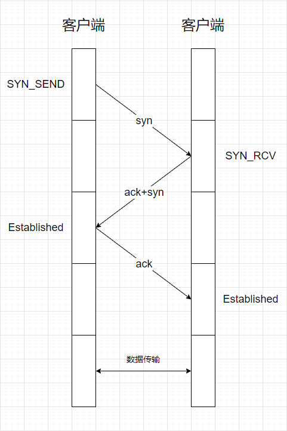
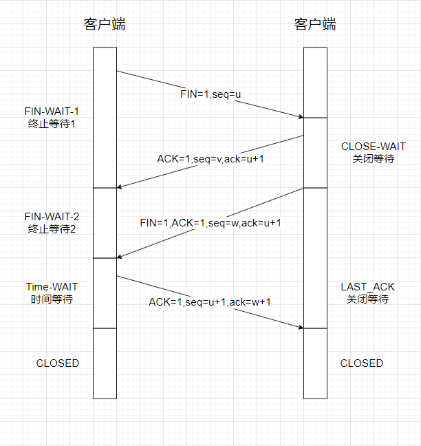

## HTTP

#### TCP三次握手
* 三次握手的过程
  
  开始客户端和服务端都处于CLOSED状态，然后服务端开始监听某个端口，进入LISTEN状态
  - 第一次握手（SYN=1，seq=x），发送完毕后，客户端进入SYN_SEND状态
  - 第二次握手（SYN=1，ACK=1，seq=y，ACKnum=x+1），发送完毕后，服务端进入SYN_RCVD状态。
  - 第三次握手（ACK=1，ACKnum=y+1），发送完毕后，客户端进入ESTABLISHED状态，当服务器接收到这个包时，也进入ESTABLISHED状态，TCP握手，即可以开始数据传输。

* TCP为什么是三次握手
  TCP为什么是三次握手，其实就是在问为什么两次不行，四次又没有必要。
  TCP是可靠传输协议，三次握手就是要确定客户端和服务端`发送`和`接收`的能力是没有问题的。两者互相考察对方的`发送`和`接收`能力。
  - 第一次握手，服务端收到数据包，服务端确定了客户端的发送能力。（客户端 ✔发送能力 ×接收能力，服务端 ×发送能力 ×接收能力）
  - 第二次握手，客户端收到数据包，客户端确定了服务端的发送和接收能力。（客户端 ✔发送能力 ×接收能力，服务端 ✔发送能力 ✔接收能力）
  - 第三次握手，服务端收到数据包，服务端确定了客服端的接收能力。（客户端 ✔发送能力 ✔接收能力，服务端 ✔发送能力 ✔接收能力）
  如果只用两次握手，客户端已经确定了服务端的`发送`和`接收`能力，但是服务端还没有确定客户端的`接收`能力。

* TCP四次挥手的过程
  
  - 第一次挥手（FIN=1，seq=u），发送完毕后，客户端进入FIN_WAIT_1状态。
  - 第二次挥手（ACK=1，ack=u+1，seq=v），发送完毕后，服务端进入CLOSE_WAIT状态，客户端接收到这个确认包后，进入FIN_WAIT_2状态。
  - 第三次挥手（FIN=1，ACK=1，seq=w，ack=u+1），发送完毕后，服务端进入LAST_ACK状态，等待来自客户端的最后一个ACK。
  - 第四次挥手（ACK=1，seq=u+1，ack=w+1）,客户端接收到来自服务器端的关闭请求，发送一个确认包，并进入TIME_WAIT状态，等待了某个固定时间（两个最大段声明周期，2MSL，2 Maximum Segment Lifetime）之后，没有收到服务端的ACK，任务服务端已经正常关闭连接，于是自己也关闭连接，进入CLISED状态。服务器端接收到这个确认包后，关闭连接，进入CLOSED状态。
  > 举个例子，第一次挥手，客户端告诉服务端‘我没啥要说的了’；第二次挥手，服务端告诉客户端‘我知道你没啥说的了’，这期间客户端并不知道服务端是否还有话说；第三次挥手，服务端告诉客户端‘我说完了’；第四次挥手，客户端告诉服务端‘我知道了’，双方挂断。

* TCP和UDP的区别
  - TCP面向连接（如打电话要先拨号监理连接）；UDP是无连接的，即发送数据之前不需要建立连接。
  - TCP要求安全性，提供可靠的服务，通过TCP连接传送的数据，不丢失、不重复、安全可靠。而UDP尽最大努力交付，即不保证可靠交付。
  - TCP是点对点连接的，UDP一对一，一对多，多对多都可以。
  - TCP传输效率相对较低，而UDP传输效率高，它适用于对高速传输和实时性有较高的通信或广播通信。
  - TCP适合于网页，邮件等；UDP适合于视频，语音广播等。
  - TCP面向字节流，UDP面向报文。
