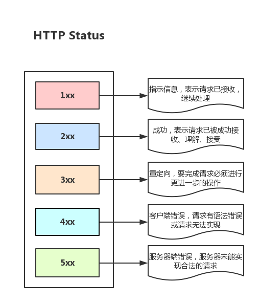
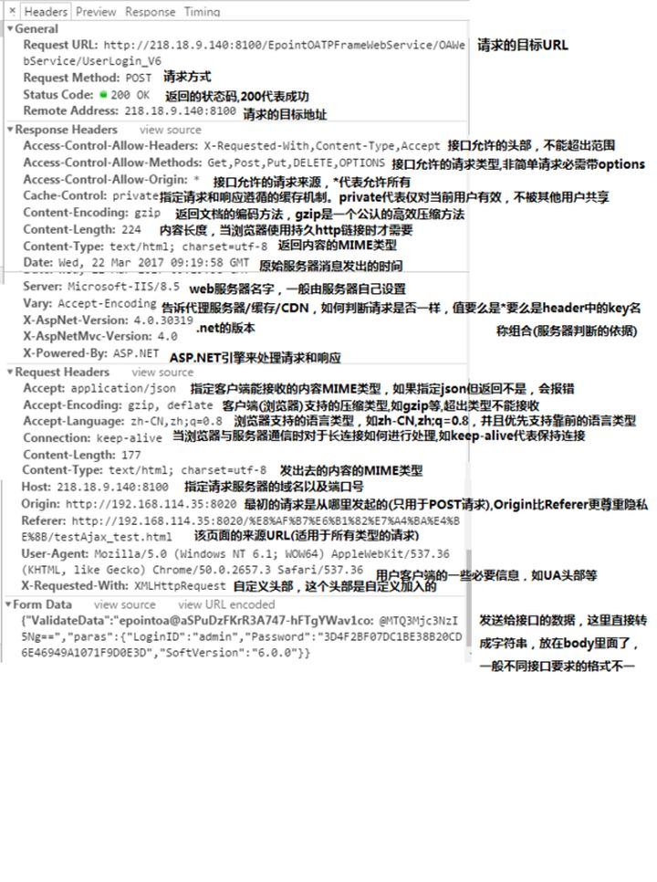
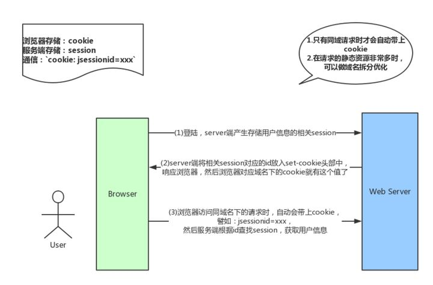
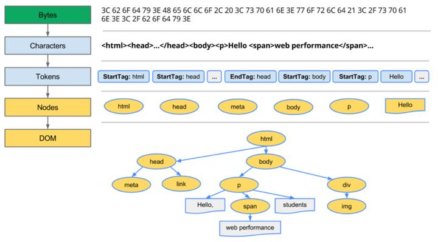
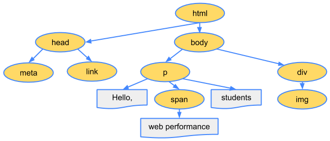
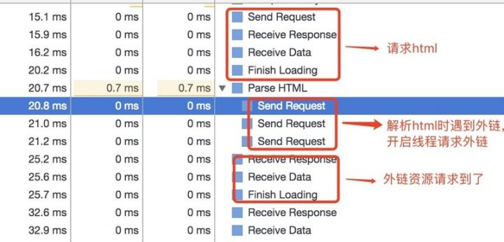

# 从输入URL到页面加载的过程

## 对知识体系的评级
#### level1：
完全没有什么概念，大概如下回答：
* 浏览器发起请求，服务端返回数据，然后前端解析成网页，执行脚本。。。
#### level2：
已经有初步概念，但是没有完整梳理过，导致无法形成一个完整的体系，或者是很多细节都不会展开，大概如下回答：
* 知道浏览器输入url后会有http请求这个概念
* 有后台这个概念，大致知道前后端的交互，知道前后端主要靠http报文通信
* 知道浏览器接收到数据后会进行解析，有一定概念，但是具体流程不熟悉（如render树构建流程，layout、paint，复合层与简单层，常用优化方案等不是很熟悉）
* 对于js引擎的解析流程有一定概念，但是细节不熟悉（如具体的形参，函数，变量提升，执行上下文以及VO、AO、作用域链，回收机制等概念不是很熟悉）
* 可能知道一些http规范初步概念，但是不熟悉（如http报文结构，常用头部，缓存机制，http2.0，https等特性，跨域与web安全等不是很熟悉）
#### level3：
基本能到这一步的，不是高阶就是接近高阶，因为很多概念并不是靠背就能理解的，而是要理解这么多，需形成体系，一般需要积累，非一日之功。
大概如下回答：
* 首先略去那些键盘输入和操作系统交互、以及屏幕显示原理、网卡等硬件交互之类的（前端向中，很多硬件原理暂时略去）
* 对浏览器模型有整体概念，知道浏览器是多进程的，浏览器内核是多线程的，清楚进程与线程之间的区别，以及输入url后会开一个新的网络线程
* 对于开启网络线程到发出一个完整的http请求中间的过程有所了解（如dns查询，tcp/ip连接，五层因特网协议栈等等，以及一些优化方案，如dns-prefetch）
* 对从服务器接收到请求到对应后台接收到请求有一定了解（如负载均衡，安全拦截以及后台代码处理等）
* 对后台和前台的http交互熟悉（包括http报文结构，场景头部，cookie，跨域，web安全，http缓存，http2.0，https等）
* 对浏览器接收到http数据包后的解析流程熟悉（包括解析html，词法分析然后解析成dom树、解析css生成css规则树、合并成render树，然后layou、painting渲染、里面可能还包括复合图层的合成、GPU绘制、外链处理、加载顺序等）
* 对js引擎解析过程熟悉（包括js的解释，预处理，执行上下文，VO，作用域链，this，回收机制等）
#### level4：
大概会有如下回答（猜的）：
* 从键盘谈到系统交互，从浏览器到CPU，从调度机制到系统内核，从数据请求到二进制、汇编，从GPU绘图到LCD显示，然后在分析系统底层的进程、内存等等。

## 梳理主干流程
知识体系中，最重要的就是骨架，脉络。有了骨架后才方便填充细节。所有先梳理下主干流程：
1. 从浏览器接收url到开启网络请求线程（这一部分可以展开浏览器的机制以及展开浏览器的机制以及进程与线程之间的关系）
2. 开启网络线程到发出一个完整的http请求（这一部分涉及到dns查询，tcp/ip请求，五层因特网协议栈等知识）
3. 从服务器接收到请求到对应后台接收到请求（这一部分可能涉及到负载均衡，安全拦截以及后台内部的处理等等）
4. 后台和前台的http交互（这一部分包括头部、响应码、报文结构、cookie等知识，可以提下静态资源的cookie优化，以及编码解码，如gzip压缩等）
5. 单独拎出来的缓存问题，http的缓存（这部分包括http缓存头部，etag，catch-control等）
6. 浏览器接收到http数据包后的解析流程（解析html-词法分析然后解析成dom树、解析css生层css规则树、合成render树，然后layout、painting渲染、复合图层的合成、GPU绘制、外链资源的处理、loaded和domcontentloaded等）
7. CSS的可视化格式模型（元素的渲染规则，如包含块，控制框，BFC，IFC等概念）
8. JS引擎解析过程（JS的解释阶段，预处理阶段，执行阶段生成执行上下文，VO，作用域链、回收机制等等）
9. 其他（可以拓展不同的知识模块，如跨域，web安全，hybrid模式等等内容）
梳理出主干骨架，然后就需要往骨架上填充细节内容

## 从浏览器接收url到开启网络请求线程
这一部分展开的内容是：浏览器进程/线程模型，JS的运行机制

### 多进程的浏览器
浏览器是多进程的，有一个主控进程，以及每一个tab页面都会新开一个进程（某些情况下多个会合并进程）
进程可能包括主控进程，插件进程，GPU，tab页（浏览器内核）等等
* Browser进程：浏览器的主进程（负责协调、主控），只有一个
* 第三方插件进程：没中类型的插件对应一个进程，仅当使用该插件时才会创建
* GPU进程：最多一个，用于3D绘制
* 浏览器渲染进程（内核）：默认每个tab页面一个进程，互不影响，控制页面渲染，脚本执行，时间处理等（有时候会优化，如多个空白tab会合并成一个进程）
  
如下图：


### 多线程的浏览器内核
每个tab页面可以看作是浏览器内核进程，然后这个进程是多线程的，它有几大类子线程
* GUI线程
* JS引擎线程
* 事件触发线程
* 定时器线程
* 网络请求线程
  

可以看到，里面的JS引擎是内核进程中的一个线程，这也是为什么常说JS引擎是单线程的

### 解析URL
输入URL后，会进行解析（URL的本质就是统一资源定位符）
URL一般包括几大部分：
* `protocol`，协议头，譬如有http，ftpdeng
* `host`，主机域名或IP地址
* `port`，端口号
* `path`，目录路径
* `query`，查询参数
* `fragment`，即`#`后的hash值，一般用来定位到某个位置

### 网络请求都是单独的线程
每次网络请求时都需要开辟单独的线程进行，譬如如果URL解析到http协议，就会新建一个网络线程去处理资源下载，因此浏览器会根据解析出得协议，开辟一个网络线程，前往请求资源（这里，暂时理解为时浏览器内核开辟的，如有错误，后续修复）

## 开启网络线程到发出一个完整的http请求
这一部分主要内容包括：`dns`查询，`tcp/ip`请求构建，`五层因特网协议栈`等等

### DNS查询得到IP
如果输入的是域名，需要进行`dns`解析成`IP`，大致流程：
* 如果浏览器有缓存，直接使用浏览器缓存，否则使用本机缓存，再没有的话就使用host
* 如果本地没有，就想dns域名服务器查询（中间可能还会经过路由，也有缓存等），查询到对应的IP

注意，域名查询时有可能是经过了CDN调度器的（如果有cdn储存功能的话）
而且，需要知道dns解析是很耗时的，因此如果解析域名过多，会让首屏加载变得过慢，可以考虑`dns-prefetch`优化

### tcp/ip请求
http的本质就是tcp/ip请求
需要了解3次握手规则建立连接以及断开连接时的四次挥手
tcp将http长报文划分为短报文，通过三次握手与服务端建立连接，进行可靠传输

#### 三次握手的步骤：
> 客户端：hello，你是server吗？
> 服务端：hello，我是server，你是client吗?
> 客户端：yes，我是client

建立连接成功后，接下来就正式传输数据
然后，待到断开连接时，需要进行四次挥手

#### 四次挥手的步骤：
> 主动方：我已经关闭了向你那边的主动通道，只能被动接收了
> 被动方：收到通道关闭的信息
> 被动方：那我也告诉你 ，我这边向你的主动通道也关闭了
> 主动方：收到数据，之后双方无法通信

#### tcp/ip的并发限制
浏览器对同一域名下并发的tcp连接是有限制的（2-10个不等）
而且在http1.0中往往一个资源下载就需要对应一个tcp/ip请求
所以针对这个瓶颈，又出现了很多的资源优化方案

#### get和post的区别
get和post虽然本质都是tcp/ip，但是两个除了在http层面外，在tcp/ip层面也有区别。
get会产生一个tcp数据包，post两个，具体为：
* get请求时，浏览器会把`header`和`data`一起发送出去，服务器响应200（返回数据）
* post请求时，浏览器先发送`headers`，服务器响应`100 continue`

浏览器在发送`data`，服务器响应200（返回数据）
再说一点，这里的区别是`specification`（规范）层面，而不是`implementation`（对规范的实现）

### 五层因特网协议栈
可以记不全，但是要有一个整体概念
其实就是一个概念：**从客户端发出http请求到服务器接收，中建会经过一系列的流程。**

简括就是：
**从应用层的发送http请求，到传输层通过三次握手建立tcp/ip连接，再到网络层的ip寻址，再到数据链路层的封装成帧，最后到物理层的利用物理介质传输。**

当然，服务端的接收就是反过来的步骤

五层因特网协议栈其实就是：
> 1. 应用层（dns，http）DNS解析成IP并发送http请求
> 2. 传输层（tcp，udp）建立tcp连接（三次握手）
> 3. 网络层（IP，ARP）IP寻址
> 4. 数据链路层（PPP）封装成帧
> 5. 物理层（利用物理介质传输比特流）物理传输（然后传输的时候通过双绞线，电磁波等各种介质）

当然，其实也有一个完整的OSI七层框架，与之相比，多了会话层、表示层。
OSI七层框架：`物理层`、`数据链路层`、`网络层`、`传输层`、`会话层`、`表示层`、`应用层`
> 表示层：主要处理两个通信系统中交换信息的表示方式，包括数据格式交换，数据加密与解密，数据压缩与终端类型转换等
> 会话层：它具体管理不同用户和进程之间的对话，如控制登录和注销过程

## 从服务器接收到请求到对应后台接收到请求
服务端在接收到请求时，内部会进行很多的处理
这里由于不是专业的后端分析，所以只是简单的介绍下

### 负载均衡
对于大型的项目，由于并发访问量很大，所以往往一台服务器是吃不消的，所以一般会有若干台服务器组成一个集群，然后配合方向代理实现负载均衡

简单的说：
**用户发起的请求都指向调度服务器（反向代理服务器，譬如安装nginx控制负载均衡），然后调度服务器根据实际的调度算法，分配不同的请求给对应集群中的服务器执行，然后调度器等待实际服务器的HTTP响应，并将它反馈给用户**

### 后台的处理
一般后台都是部署到容器中的，所以一般为：
* 先是容器接受到请求（如tomcat容器）
* 然后对应容器中的后台程序接受到请求（如java程序）
* 然后就是后台会有自己统一处理，处理完后响应响应结果

概括下：
* 一般有的后端是有统一的验证的，如安全拦截，跨域验证
* 如果这一步不符合规则，就直接返回相应的http报文（如拒绝请求等）
* 然后当验证通过后，才会进入实际的后台代码，此时是程序接收到请求，然后执行（譬如查询数据库，大量计算等等）
* 等程序执行完毕后，就会返回一个http响应包（一般这一步也会经过多层封装）
* 然后就是将这个包从后端发送到前端，完成交互

### 后台和前台的http交互
前后端交互时，http报文作为信息的载体
所以http是一块很重要的内容，这一部分重点介绍它

#### http报文结构
报文一般包括了：`通用头部`，`请求/响应头部`，`请求/响应体`

##### 通用头部
这也是开发人员见过最多的信息，包括如下：
> Request Url：请求的web服务器地址
> Request Method： 请求方式（GET、POST、OPTIONS、PUT、HEAD、DELETE、CONNECT、TRACE）
> Status Code：请求的返回状态码，如200代表成功
> Remote Address：请求的远程服务器地址（会转为IP）

譬如，在跨域拒绝时，可能是method为`options`，状态码为`404/405`等（当然，实际上可能的组合有很多）

其中，method的话一般分为两批次：
> HTTP1.0定义了三种请求方法：GET，POST和HEAD方法。
> 以及几种Additional Request Methods：PUT、DELETE、LINK、UNLINK
> HTTP1.1定义了八种请求方法：GET、POST、HEAD、OPTIONS、PUT、DELETE、TRACE和CONNECT方法。

这里面最常用到的就是状态码，很多时候都是通过状态码来判断，如（列举几个最常见的）：
> 200 表明该请求被成功地完成，所有请求的资源发送回客户端
> 304 自从上次请求后，请求的网页未修改过，请客户端使用本地缓存
> 400 客户端请求有错（譬如可以是安全模块拦截）
> 401 请求未经授权
> 403 禁止访问（譬如可以是未登录时禁止）
> 404 资源未找到
> 500 服务器内部错误
> 503 服务不可用
> ...

在列举下大致不同范围状态的意义
> 1xx 指示信息，表示请求已接收，继续处理
> 2xx 成功，表示请求已被成功接收、理解、接受
> 3xx 重定向，要完成请求必须进行更进一步的操作
> 4xx 客户端错误，请求有语法错误或请求无法实现
> 5xx 服务器端错误，服务器端未能实现合法的请求



总之，请求出错时，状态码能帮助快速定位问题。

##### 请求/响应头部
请求和响应头部也是分析时常用到的
常用的请求头部（部分）：
> Accept：接收类型，表示浏览器支持的MIME类型（对标服务端返回的Content-Type）
> Accept-Encoding：浏览器支持的压缩类型，如gzip等，超出类型不能接收
> Content-Type：客户端发送出去实体内容的类型
> Cache-Control：指定请求和响应遵循的缓存机制，如no-cache
> If-Modified-Since：对应服务端的Last-Modified，用来匹配看文件是否变动，只能精确到1s之内，http1.0中
> Expires：缓存控制，在这个时间内不会请求，直接使用缓存，http1.0，而且是服务端时间
> Max-age：代表资源再本地缓存多少秒，有效时间内不会请求，而是使用缓存，http1.1中
> If-None-Match：对应服务端的ETag，用来匹配文件内容是否改变（非常精确），http1.1中
> Cookie：有cookie并且同域访问会自动带上
> Connection：当浏览器与服务器通信时对于长连接如何进行处理，如keep-alive
> Host：请求的服务器URL
> Origin：最初的请求是从哪里发起的（只会精确到端口），Origin比Referer更尊重隐私
> Referer：该页面的来源URL（适用于所有类型的请求，会精确到详细页面地址，csrf拦截常用到这个字段）
> User-Agent：用户客户端的一些必要信息，如UA头部等

常用的响应头部（部分）：
> Access-Control-Allow-Headers：服务器端允许的请求Headers
> Access-Control-Allow-Methods：服务端允许的请求方法
> Access-Control-Allow-Origin：服务器端允许的请求Origin头部（譬如为*）
> Content-Type：服务端返回的实体内容的类型
> Date：数据从服务器发送的时间
> Cache-Control：告诉浏览器或者其他用户，什么环境可以安全缓存文档
> Last-Modified：请求资源的最后修改时间
> Expires：应该在什么时候任务文档已经过期，从而不再缓存它
> Max-age：客户端的本地资源应该缓存多少秒，开启了Cache-Control后有效
> ETag：请求变量的实体标签的当前值
> Set-Cookie：设置和页面关联的cookie，服务器通过这个头部把cookie传给客户端
> Keep-Alive：如果客户端有keep-alive，服务端也会有相应（如timeout=38）
> Server：服务器的一些相关信息

一般来说，请求头部和响应头部是匹配分析的。
譬如请求头部的`Accept`要和响应头部的`Content-Type`匹配，否则会报错
譬如，跨域请求时，请求头部的`Origin`要匹配响应头部的`Access-Control-Allow-Origin`，否则会报跨域错误
譬如，在使用缓存时，请求头部的`If-Modified-Since`、`If-None-Match`分别和响应头部的`Last-Modified`、`ETag`对应

##### 请求/响应实体
http请求时，除了头部，还有消息实体，一般来说
请求实体中会将一些需要的参数都放入进入（用于post请求）。
譬如实体中可以放参数的序列化形式（a=1&b=2这种），或者直接放表单对象（Form Data对象，上传时可以夹杂参数以及文件），等等。
而一般响应实体中，就是放服务端需要传给客户端的内容
一般现在的借口请求时，实体中就是对应信息的json格式，而像页面请求这种，里面就是直接放了一个html字符串，然后浏览器自己解析并渲染。

##### CRLF
CRLF（Carriage-Return Line-Feed），意思是回车换行，一般作为分隔符存在
请求头和实体消息之间有一个CRLF分隔，响应头部和响应实体之间用一个CRLF分隔
一般来说（分隔符类别）：
> CRLF -> windows-style
> LF -> Unix style
> CR -> Mac Style

如下图是对某请求的http报文结构的建哟啊分析


##### cookie以及优化
cookie是浏览器的一种本地储存方式，一般用来帮助客户端和服务端通信的，常用来进行身份校验，结合服务端的session使用。
场景如下（简述）：
> 在登录页面，用户登录
此时服务端会生成一个session，session中有对于用户的信息（如用户名、密码等）
然后会有一个sessionid（相当于是服务端的这个session对应的key）
然后服务端在登录页面中写入cookie，值就是：jssessionid=xxx
然后浏览器本地就有这个cookie了，以后访问同域名下的页面时，自动带上cookie，自动检验，在有效时间内无需二次登录。

上述就是cookie的常用场景简述

一般来说，cookie是不允许存放敏感信息的（千万不要明文储存用户名、密码），因为非常不安全，如果一定要强行储存，首先，一定要在cookie中设置`httponly`（这样就无法通过js操作了），另外可以考虑rsa等非对称加密（因为实际上，浏览器本地也是容易被攻克的，并不安全）。另外由于同域名的资源请求时，浏览器会默认带上本地的cookie，针对这种情况，在某些场景下时需要优化的。

譬如以下场景：
> 客户端在域名A下有cookie（这个可以是登录时由服务端写入的）
然后在域名A下有一个页面，页面中有很多依赖的静态资源（都是域名A的，譬如20个静态资源）
此时就有一个问题，页面加载，请求这些静态资源时，浏览器会默认带上cookie
也就是说，这20个静态资源的http请求，每个都带上cookie，而实际上静态资源并不需要cookie验证
此时就造成了较为严重的浪费，而且也降低了访问速度（因为内容更多了）

当然了，针对这种场景，是有优化方案的（多域名拆分）。具体做法就是：
* 将静态资源分组，分别放到不同的域名下（如static.base.com）
* 而page.base.com（页面所在域名）下请求时，时不回带上static.base.com域名的cookie的，所以就避免了浪费

说到了多域名拆分，这里再提一个问题，那就是：
* 在移动端，如果请求的域名数过多，会降低请求速度（因为域名整套解析流程时很耗费时间的，而且移动端一般宽带都比不上pc）
* 此时就需要用到一种优化方案：`dns-prefetch`（让浏览器空闲时提前解析dns域名，不过也请合理使用）

关于cookie的交互，可以看下图总结


##### gzip压缩
首先，明确`gzip`是一种压缩格式，需要浏览器支持才有效（不过一般现在浏览器都支持），而且`gzip`压缩效率很好（高达70%左右），`gzip`一般是由`apache`、`tomcat`等web服务器开启。除了`gzip`还有其他的压缩格式，如`deflate`，没有`gzip`高效，且不流行，所以一般只需要在服务器上开启了`gzip`压缩，之后的请求都是基于`gzip`压缩格式的了。

#### 长连接与短连接
首先看`tcp/ip`层面的定义：
* 长连接：一个tcp/ip连接上可以连续发送多个数据包，在tcp连接保持期间，如果没有数据包发送，需要双方检测包以维持此连接，一般需要自己做在线维持（类似于心跳包）
* 短连接：通信双方有数据交互时，就建立一个tcp连接，数据发送完成后，则断开次tcp连接

然后在`http`层面：
* `http1.0`中，默认使用的是短连接，也就是说，浏览器每进行一次http操作，就建立一次连接，任务结束就中断连接，譬如每一个静态资源请求时都是一个单独的连接
* `http1.1`起，默认使用长连接，使用长连接会有这一行`Connection: keep-alive`，在长连接的情况下，当一个网页打开完成后，客户端和服务端之间用于传输http的tcp连接不会关闭，如果客户端再次访问这个服务端的页面，会继续使用这一条已经建立的连接

注意：**keep-alive不会永远保持，它有一个持续时间，一般在服务器中配置，另外长连接需要客户端和服务端都支持才有效**

#### http2.0
http2.0不是https，它相当于http的下一代规范
然后简述下http2.0与http1.1的显著区别：
* http1.1中，每请求一个资源，都是需要开启一个tcp/ip连接的，所以对应的结果是，每一个资源对杨一个tcp/ip请求，由于tcp/ip本身有并发数限制，所以当资源一多，速度就显著慢下来
* http2.0中，一个tcp/ip请求可以请求多个资源，也就是说只要一次tcp/ip请求，就可以请求若干个资源，分割成小的帧请求，速度明显提升

所以，如果http2.0全面应用，很多http1.1中的优化方案就无需用到了（譬如打包成精灵图，静态资源多域名拆分等）
简述一下http2.0的一些特性：
* 多路复用（即一个tcp/ip连接可以请求多个资源）
* 首部压缩（http头部压缩，减少体积）
* 二进制分帧（在应用层跟传送层之间增加了一个二进制分帧层，改进传输性能，实现低延迟和高吞吐量）
* 服务器端推送（服务端可以对客户端的一个请求发出多个响应，可以主动通知客户端）
* 请求优先级（如果流被赋予了优先级，它就会机遇这个优先级来处理，由服务器决定需要多少资源来处理改请求）

#### https
https就是安全版本的http，譬如一些支付等操作基本都是基于https的，因为http请求的安全系数太低了。
简单来看，https与http的区别就是：**在请求钱，会建立ssl链接，确保接下来的通信都是加密的，无法被轻易截取分析。**
一般来说，如果要将万丈升级成https，需要后端支持（后端需要申请证书等），然后https的开销也比http要大（因为需要额外建立安全链接以及加密等），所以一般来说http2.0配合https的体验更佳。

一般来说，主要关注的就是SSL/TLS的握手流程，如下：
> 1. 浏览器请求建立SSl链接，并向服务端发送一个随机数-Client random和客户端支持的加密方法，比如RSA加密，此时是明文传输。
> 2. 服务端从中选出一组加密算法与Hash算法，回复一个随机数-Server random，并将自己的身份信息以证书的形式发回给浏览器（证书里包含了网站地址，非对称加密的公钥，以及证书颁发机构等信息）
> 3. 浏览器收到服务端的证书后
>    - 验证证书的合法性（颁发机构是否合法，证书中包含的网址是否和正在访问的一样），如果证书信任，则浏览器会显示一个小锁头，否则会有提示
>    - 用户接收证书后（不管信不信任），浏览器生产新的随机数-Premaster secret，然后证书中的公钥以及指定的加密方法加密`Premaster secret`，发送给服务器。
>    - 利用Client random、Server random和Premaster secret通过一定的算法生成HTTP链接数据传输的对称加密key-`session key`
>    - 利用约定好的HASH算法计算握手消息，并使用生成的`session key`对消息进行加密，最后将之前生成的所有信息发送给服务端。
> 4. 服务端收到浏览器的回复
>    - 利用已知的加解密方式与自己的私钥进行解密，获取`Premaster secret`
>    - 和浏览器相同规则生成`session key`
>    - 使用`session key`解密浏览器发来的握手消息，并验证Hash是否与浏览器发来的一致
>    - 使用`session key`加密一段握手消息，发送给浏览器
> 5. 浏览器解密并计算握手消息的HASH，如果与服务端发来的HASH一致，此时握手过程结束

**之后所有的https通信数据将由之前浏览器生成的`session key`并利用对称加密算法进行加密**

加一张图（来源：[阮一峰-图解SSL/TLS协议](https://link.zhihu.com/?target=http%3A//www.ruanyifeng.com/blog/2014/09/illustration-ssl.html)）


#### 单独拎出来的缓存问题，http的缓存
前后端的http交互中，使用缓存能很大程度上的提升效率，而且基本上对性能有要求的前端项目都是必需使用缓存的

##### 强缓存与弱缓存
缓存可以剪短的划分成两种类型：`强缓存（200 from cache）`与`协商缓存（304）`
区别简述如下：
* 强缓存（200 from cache）时，浏览器如果判断本地缓存未过期，就直接使用，无需发起http请求
* 协商缓存（304）时，浏览器会向服务端发起http请求，然后服务端告诉浏览器文件未改变，让浏览器使用本地缓存

对于协商缓存，使用`Ctrl + F5`强制刷新可以使得缓存无效
但是对于强缓存，在未过期时，必须更新资源路径才能发起新的请求（更改了路径相当于是另一个资源了，这是前端工程化中常用到的技巧）

##### 缓存头部简述
上述提到了强缓存和协商缓存，那它们是怎样区分的呢？
答案是通过不同的http头部控制
先看下这几个头部

> If-None-Match/E-tag、If-Modified-Since/Last-Modified、Cache-Control/Max-Age、Pragma/Expires

这些就是缓存中常用到的头部，这里不展开。仅列举下大致使用。

属于强缓存控制的：
> (http1.1) Cache-Control/Max-Age
> (http1.0) Pragma/Expires

注意：**`Max-Age`不是一个头部，他是`Cache-Control`头部的值**

属于协商缓存控制的：
> (http1.1) If-None-Match/E-tag
> (http1.0) If-Modified-Since/Last-Modified

HTML页面也有一个meta标签可以控制缓存方案`Pragma`
```html
<meta HTTP-EQUIV="Pragma" CONTENT="no-chche">
```
不过，这种方案还是比较少用到，因为支持情况不佳，譬如缓存代理服务器肯定不支持，所以不推荐

##### 头部的区别
首先明确，http的发展是从http1.0到http1.1，而在http1.1中，出了一些新内容，弥补了http1.0的不足

**http1.0中的缓存控制：**
* `Pragma`：严格来说，它不属于专门的缓存控制头部，但是它设置`no-cache`时可以让本地强缓存失效（属于编译控制，来实现特定的指令，主要是因为兼容http1.0，所以以前被大量应用）
* `Expires`：服务端配置的，属于强缓存，用来控制在规定的时间之前，浏览器不会发出请求，而是直接使用本地缓存，注意，Expires一般对应服务端时间，如`Expires: Fir, 30 Oct 1998 14:19:41`
* `If-Modified-Since/Last-Modified`：值两个是成对出现的，属于协商缓存的内容，其中浏览器的头部是`If-Modified-Since`，而服务端的是`Last-Modified`，它的作用是，在发起请求时，如果`If-Modified-Since`和`Last-Modified`匹配，那么代表服务器资源并未改变，因此服务端不会反悔资源实体，而是只反悔头部，通知浏览器可以使用本地缓存。`Last-Modified`，顾明司仪，指的是文件最后的修改时间，而且只能精确到`1s`以内

**http1.1中的缓存控制：**
* `Cache-Control`：缓存控制头部，有`no-cache`、`max-age`等多种取值
* `Max-Age`：服务端配置，用来控制强缓存，在规定的时间之内，浏览器无需发出请求，直接使用本地缓存，注意，`Max-age`是`Cache-Control`头部的值，不是独立的头部，譬如`Cache-Control: max-age=3600`，而且它的值得是绝对时间，由浏览器自己计算
* `If-None-Match/E-tag`：这两个是成对出现的，属于协商缓存的内容，其中浏览器的头部是`If-None-Match`，而服务端的是`E-tag`，同样,发出请求后，如果`If-None-Match`和`E-tag`匹配，则代表内容未变，通知浏览器使用本地缓存，和`Last-Modified`不同，`E-tag`更精确，它是类似于指纹一样的东西，基于`FileEtag INode Mtime Size`生成，也就是说，只要文件变，指纹就会变，而且没有1s精确度的限制。

**Max-Age相比Expires？**
`Expires`使用的是服务器端的时间
但是有时候会有这样一种情况-客户端时间和服务端不同步
那这样，可能就会出现问题了，造成了浏览器本地的缓存无用或者一直无法过期
所以一般`http1.1`后不推荐使用`Expires`
而`Max-Age`使用的是客户端本地时间的计算，因此不会有这个问题
所以推荐使用`Max-Age`。
注意，如果同时启用`Cache-Control`与`Expires`，`Cache-Control`优先级高。

**E-tag相比Last-Modified？**
Last-Modified：
* 表明服务端的文件最后何时改变的
* 它有一个缺陷就是只能精确到1s
* 然后还有一个问题就是有的服务端的文件会周期性的改变，导致缓存失效

而E-tag：
* 是一种指纹机制，代表文件相关指纹
* 只有文件变才会变，也只要文件变就会变，
* 也没有精确时间的限制，只要文件一变，立马E-tag就不一样了

如果同时带有E-tag和Last-Modified，服务端会优先检查E-tag
各大缓存头部的整体关系如下图


## 解析页面流程

前面有提到http交互，那么接下来就是浏览器获取到html，然后解析，渲染

### 流程简述

浏览器内核拿到内容后，渲染步骤大致可以分为以下几步：
> 1. 解析html，构建DOm树
> 2. 解析css，生成css规则树
> 3. 合并DOM树和css规则，生成render树
> 4. 布局render树（Layout/reflow），负责各元素尺寸、位置的计算
> 5. 绘制render树（paint），绘制页面像素信息
> 6. 浏览器会将各层的信息发送给GPU，GPU会将各层合成（composite），显示在屏幕上

如下图：


### HTML解析，构建DOm

整个渲染步骤中，HTML解析是第一步。
简单的解释，这一步的流程是这样的：**浏览器解析HTML，构建DOM树。**
但实际上，在分析整体构建时，却不能一笔带过，得稍微展开。
解析HTML到构建出DOM当然过程可以简述如下：
> Bytes -> characters -> tokens -> nodes -> DOM

譬如建设有这样一个HTML页面：
```html
<html>
  <head>
    <meta name="viewport" content="width=device-width,initial-scale=1">
    <link href="style.css" rel="stylesheet">
    <title>Critical Path</title>
  </head>
  <body>
    <p>Hello <span>web performance</span> students!</p>
    <div></div>
  </body>
</html>
```
浏览器的处理如下：


列举其中的一些重点过程：
> 1. Conversion转换：浏览器将获得的HTML内容（Bytes）基于他的编码转换为单个字符
> 2. Tokenizing分词：浏览器按照HTML规范标准将这些字符转换为不同标记的token。每个token都有自己独特的含义一级规则集
> 3. Lexing词法分析：分词的结果是得到一堆的token，此时把他们转换为对象，这些对象分别定义他们的属性和规则
> 4. DOM构建：因为HTML标记定义的就是不同标签之间的关系，这个关系就像是一个树形结构一样
> 例如：body对象的父节点就是HTML对象，然后段落p对象的父节点就是body对象

最后DOM树如下：


### 生成CSS规则
同理，CSS规则树的生成也是类似。简述为：
> Bytes -> characters -> tokens -> nodes -> CSSOM

譬如`style.css`内容如下：
```css
body { font-size: 16px }
p { font-weight: bold }
span { color: red }
p span { display: none }
img { float: right }
```
最终的CSSOM树就是：


### 构建渲染树

当DOM树和CSSOM都有了后，就要开始构建渲染树了
一般来说，渲染树和DOM树是相对应的，但不宜严格上的一一对应
因为有一些不可见的DOM元素不会插入到渲染树中，如head这种不可见的标签或者`display: none`等

整体来说可以看图：


### 渲染

有了render树，接下来就是开始渲染，基本流程如下：


图中重要的四个步骤就是：
> 1. 计算CSS样式
> 2. 构建渲染树
> 3. 布局，主要定位坐标和大小，是否换行，各种position overflow z-index属性
> 4. 绘制，将图像绘制出来

然后，图中的线与箭头代表通过js动态修改了DOM或CSS，导致了重新布局（`Layout`）或渲染（`Repaint`）
这里`Layout`和`Repaint`的概念是由区别的：
* `Layout`，也称为`Reflow`，即回流，一般意味着元素的内容、结构、位置或尺寸发生了变化，需要重新计算样式和渲染树
* `Repaint`，即重绘。意味着元素发生的改变只是影响了元素的一些外观之类的时候（例如，背景色，边框颜色，文字颜色等），此时只需要应用新样式绘制这个元素就可以了

回流的成本开销要高于重绘，而且一个节点的回流往往会导致子节点以及同级节点的回流，所以优化方案中一般都包括，尽量避免回流。

**什么会引起回流？**
> 1. 页面渲染初始化
> 2. DOM结构改变，比如删除了某个节点
> 3. render树变化，比如减少了padding
> 4. 窗口resize
> 5. 最复杂的一种：获取某些属性，引发回流，
> 很多浏览器会对回流做优化，会等到数量足够时做一次批量回流，
> 但是除了render树的直接变化，当获取一些属性时，浏览器为了获得正确的值也会触发回流，这样使得浏览器优化无效，包括：
>     - offset(Top/Left/Width/Height)
>     - scroll(Top/Left/Widht/Height)
>     - client(Top/Left/Width/Height)
>     - width,height
>     - 调用了getComputedStyle()或者IE的currentStyle

回流一定伴随着重绘，重绘却可以单独出现
所以一般会有一些优化方案，如：
* 减少逐项更改样式，最好一次性更改`style`，或者将样式定义为`class`并一次性更新
* 避免循环操作dom，创建一个domcumentFragment或div，在它上面应用所有DOM操作，最后再把它添加到`window.document`
* 避免多次读取`offset`等属性。无法避免则将它们缓存到变量
* 将复杂的元素绝对定位或者固定定位，使得它脱离文档流，否则回流代价会很高

**注意：改变字体大小会引发回流**

再看一个示例：
```js
var s = document.body.style;

s.padding = '2px';  // 回流+重绘
s.border = '1px solid red';  // 再一次 回流+重绘 
s.color = 'blue';  // 再一次重绘
s.backgroundColor = '#ccc';  // 再一次重绘
s.fontSize = '14px';  // 再一次 回流+重绘
// 添加node，再一次 回流+重绘
document.body.appendChild(document.createTextNode('abc'));
```

### 简单层与复合层

上述中的渲染中止步于绘制，但实际上绘制这一步也没有那么简单，它可以结合复合层和简单层的概念来讲。
这里不展开，简单介绍一下：
* 可以认为默认只有一个复合图层，所有的DOM节点都是在这个复合图层下的
* 如果开启了硬件加速功能，可以将某个节点变成复合图层
* 复合图层之间的绘制互不干扰，由GPU直接控制
* 而简单图层中，就算是`absolute`等布局，变化时不影响整体的回流，但是由于在同一个图层中，仍然是会影响绘制的，因此做动画时性能仍然很低。而复合层是独立的，所以一般做动画推荐使用硬件加速

### Chrome中的调试

Chrome的开发者工具中，Performance中可以看到详细的渲染过程：


### 资源外链的下载

上面介绍了html解析，渲染流程。但实际上，在解析html时，会遇到一些资源连接，此时就需要进行单独处理了

简单起见，这里将遇到的静态资源分为以下几大类：
* CSS样式资源
* JS脚本资源
* img图片类资源

#### 遇到外链时的处理

当遇到上述外链时，会单独开启一个下载线程去下载资源（`http1.1`中是每一个资源的下载都要开启一个`http`请求，对应一个`tcp/ip`连接）

##### 遇到CSS样式资源

CSS资源的处理有几个特点：
* CSS下载时异步，不会阻塞浏览器构建DOM树
* 但是会阻塞渲染，也就是在构建render时，会等到css下载解析完毕后才进行（这点与浏览器优化有关，防止css规则不断改变，避免了重复的构建）
* 有例外，`media query`声明的CSS是不会阻塞渲染的

##### 遇到JS脚本资源

JS脚本资源的处理有几个特点：
* 阻塞浏览器的解析，也就是说发现一个外链脚本时，需等待脚本下载完成并执行后才会继续解析HTML
* 浏览器的优化，一般现代浏览有优化，在脚本阻塞时，也会继续下载其他资源（当然有并发上限），但是虽然脚本可以并行下载，解析过程仍然是阻塞的，也就是说必须这个脚本执行完毕后才会接下来的解析，并行下载只是一种优化而已
* `defer`与`async`，普通的脚本是会阻塞浏览器解析的，但是可以加上`defer`或`async`属性，这样脚本就变成异步了，可以等到解析完毕后再执行

注意，`defer`和`async`是有区别的：**`defer`是延迟执行，而`async`是异步执行。**

简单的说：
* `async`是异步执行，异步下载完毕后就会执行，不确保执行顺序，一定在`onload`之前，但不确定在`DOMContentLoaded`事件的前或后
* `defer`是延迟执行，在浏览器看起来的效果像是将脚本放在`body`后面一样（虽然按规范应该是在`DOMContentLoad`事件前，但实际上不同浏览器的效果不一样，也有可能在它的后面）

##### 遇到img图片类资源

遇到图片等资源时，直接就是异步下载，不会阻塞解析，下载完毕后直接用图片替换原有src的地方

##### loaded和DOMContentloaded

简单的对比：
* `DOMContentloaded`事件触发时，仅当DOM加载完成，不包括样式表，图片（譬如如果有`async`加载的脚本就不一定完成）
* `loaded`事件触发时，页面上所有的DOM，样式表，脚本，图片都已经加载完成了

### CSS的可视化格式模型
前面提到了整体的渲染概念，但实际上文档树中的元素是按什么渲染规则渲染的，是可以进一步展开的，此部分内容即：**CSS的可视化格式模型**

先了解：
* CSS中规定每一个元素都有自己的盒子模型（相当于规定了元素如何显示）
* 然后可视化格式模型则是把这些盒子按照规则摆放到页面上，也就是如何布局
* 换句话，盒子模型规定了怎么在页面里摆放盒子，盒子的相互作用等等

说到底：**CSS的可视化格式模型就是规定了浏览器在页面中如何处理文档树**

关键字：
> 包含块（Containing Block）
> 控制框（Controlling Box）
> BFC（Block Formatting Context）
> IFC（Inline Formatting COntext）
> 定位体系
> 浮动
> ...

另外，CSS有三种定位机制：普通流，浮动，绝对定位，如无特别提及，下文中都是针对普通流

#### 包含块（Containing Block）

一个元素的box的定位和尺寸，会与某一矩形框有关，这个框就称之为包含块。
元素会为它的子孙元素创建包含块，但是，并不是说元素的包含块就是他的父元素，元素的包含块与它的祖先元素的样式等有关系

譬如：
* 根元素是最顶端的元素，它没有父节点，它的包含块就是初始包含块
* static和relative的包含块由它最近的块级、单元格或者行内块祖先元素的内容框（content）创建
* fixed的包含块是当前可视窗口
* absolute的包含块由它最近的position属性为absolute、relative或者fixed的祖先元素创建
* 如果其祖先元素是行内元素，则包含块取决于其祖先元素的direction特性
* 如果祖先元素不是行内元素，那么包含块的区域应该是祖先元素的内边距边界

#### 控制框（Controlling Box）

块级元素和块框以及行内元素和行框的相关概念

##### 块框：
* 块级元素会生成一个块框（Block Box），块框会占据一整行，用来包含子box和生成的内容
* 块框同时也是一个块包含框（Containing Box），里面要么只包含块框，要么只包含行内框（不能混杂），如果块框内部有块级元素也有行内元素，那么行内元素会被匿名块框包围

关于**匿名块框**的生成，示例：
```html
<DIV>
Some text
<P>More text
</DIV>
```
div生成了一个块框，包含了另一个块框p以及文本内容Some text，此时Some text文本会被强制加到一个匿名的块框里面，被div生成的块框包含（其实这个就是IFC中提到的行框，包含这些行内框的这一行匿名块形成的框，行框和行内框不同）

换句话说：
**如果一个块框在其中包含另一个块框，那么我们强迫它只能包含块框，因此其它文本内容生成出来的都是匿名块框（而不是匿名行内框）**

##### 行内框：
* 一个行内元素生成一个行内框
* 行内元素能排在一行，允许左右有其它元素

关于**匿名行内框**的生成，示例：
```html
<P>Some <EM>emphasized</EM> text</P>
```
p元素生成一个块框，其中有几个行内框（如em），以及文本Some，text，此时会专门为这鞋文本生成匿名行内框

##### display属性的影响

display的几个属性也可以影响不同框的生成：
* block，元素生成一个块框
* inline，元素产生一个或多个行内框
* inline-block，元素产生一个行内级块框，行内块框的内部会被当做块来格式化，而此元素本身会被当做行内级框来格式化（这也是为什么会产生BFC）
* none，不生成框，不再格式化结构中，当然了，另一个visiblity: hidden则会产生一个不可见的框

总结：
* 如果一个框里，有一个块级元素，那么这个框里的内容都会被当作块框来进行格式化，因为只要出现了块元素，就会将里面的内容分为几块，每一块独占一行（出现行内可以用匿名块框解决）
* 如果一个框里，没有任何块级元素，那么这个框里的内容会被当成行内框来格式化，因为里面的内容是按照顺序成行的排列

#### BFC（Block Formatting Context）

FC即格式上下文，它定义框内部的元素渲染规则，比较抽象，譬如

> FC像是一个大箱子，里面装有很多元素
> 箱子可以隔开里面的元素和外面的元素（所以外部并不会影响FC内部的渲染）
> 内部的规则可以是：如何定位，宽高计算，margin折叠等等

不同类型的框参与的FC类型不同，譬如块级框对应BFC，行内框对应IFC
**注意，并不是所有的框都会产生FC，而是符合特定条件才会产生，只有产生了对应的FC后才会应用对应渲染规则**

##### BFC规则：
> 在块格式化上下文中
> 每一个元素左外边与包含块的左边相接触（对于从右到左的格式化，右外边接触右边）
> 即使存在浮动也是如此（所以浮动元素正常会直接贴近它的包含块的左边，与普通元素重合）
> 除非这个元素也创建了一个新的BFC

总结几点BFC特点：
1. 内部box在垂直方向，一个接一个的放置
2. box的垂直方向由margin决定，属于同一个BFC的两个box间的margin会重叠
3. BFC区域不会与float box重叠（可用于排版）
4. BFC解释页面上的一个隔离的独立容器，容器里面的子元素不会影响到外面的元素。反之也是如此
5. 计算BFC的高度时，浮动元素也参与计算（不会浮动坍塌）

如何触发BFC？
1. 根元素
2. float属性不为none
3. position为absolute或fixed
4. display为inline-block，flex，inline-flex，table，table-cell，table-caption
5. overflow不为visible

这里提下，dispaly: table，它本身不产生BFC，但是它会产生匿名框（包含display: table-cell的框），而这个匿名框产生BFC